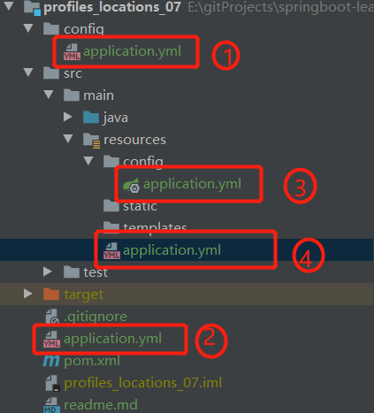

#配置文件的加载位置
## 1. springboot的默认配置文件为application.properties/ application.yml
## 2. springboot项目启动的时候会扫描项目下的配置文件作为springboot项目的配置
```
    file:        ./conifg       项目的根目录下的config文件夹
    file:        ./             项目的根目录
    classpath:   /config        类路径下的config文件夹
    classpath:   /              类路径下
```
  以上是按照优先级从高到低的顺序排列，所有位置的配置文件都会被加载，所有配置文件里面的内容互补   
  （配置文件里面相同的内容高优先级覆盖低优先级，若是每个文件的配置内容都不相同，那么配置都生效）   
  可以通过spring.config.location来改变默认配置   
  
  测试, 项目结构如下(图中的数字从小到大表示优先级从高到低):   
  
  分别配置端口对应的优先级为8081，8082，8083，8084
## 3. 测试发现springboot2.3.1版本，默认只读取类路径下的配置文件了
## 4. 总结 配置文件位置跟随springboot版本变化而变化，，具体情况得看对应版本的官方文档